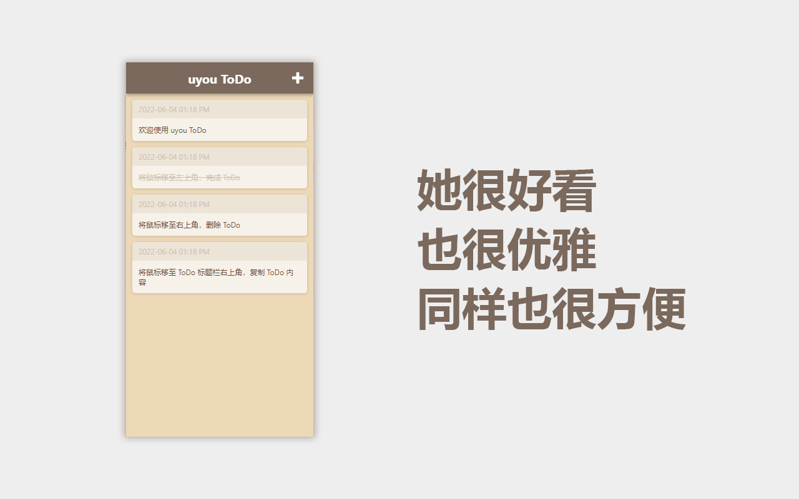
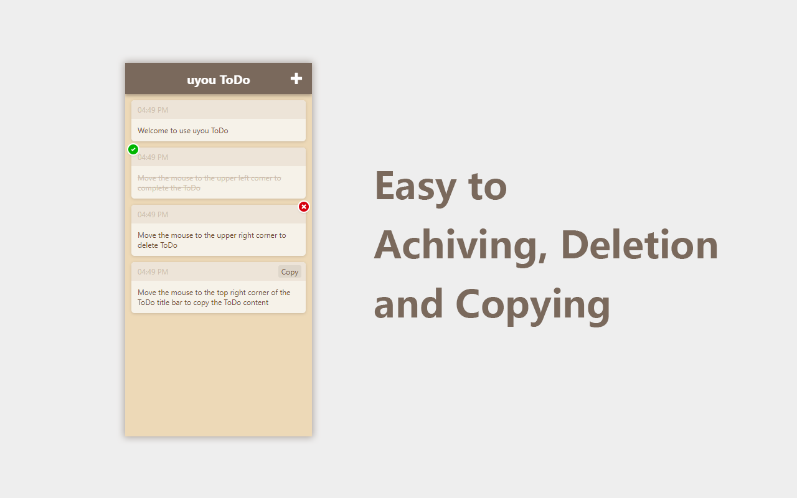

# uyouTodo
 
English | [中文简体](https://github.com/tonylu110/uyouTodo/tree/main/README/zh_cn)

## How to use ?

1. Build chrome extension
    ``` 
    yarn
    yarn build
    ```
    * enable chrome developer
    * click the **Load unpacked extension** button
    * select the build folder to install it
    
2. Chrome web store or edge addons store\
   chrome: [TO CHROME WEB STORE](https://chrome.google.com/webstore/detail/uyou-todo/ejlgjpkidfhbglcliliiolhhjanipojk?hl=zh-CN&authuser=0)\
   edge: [TO EDGE ADDONS STORE](https://microsoftedge.microsoft.com/addons/detail/uyou-todo/efmogbhijocfeiaflifgjjkmfhjoplnp)

3. To release page and download crx\
   [TO RELEASE](https://github.com/tonylu110/uyouTodo/releases)

## Preview



