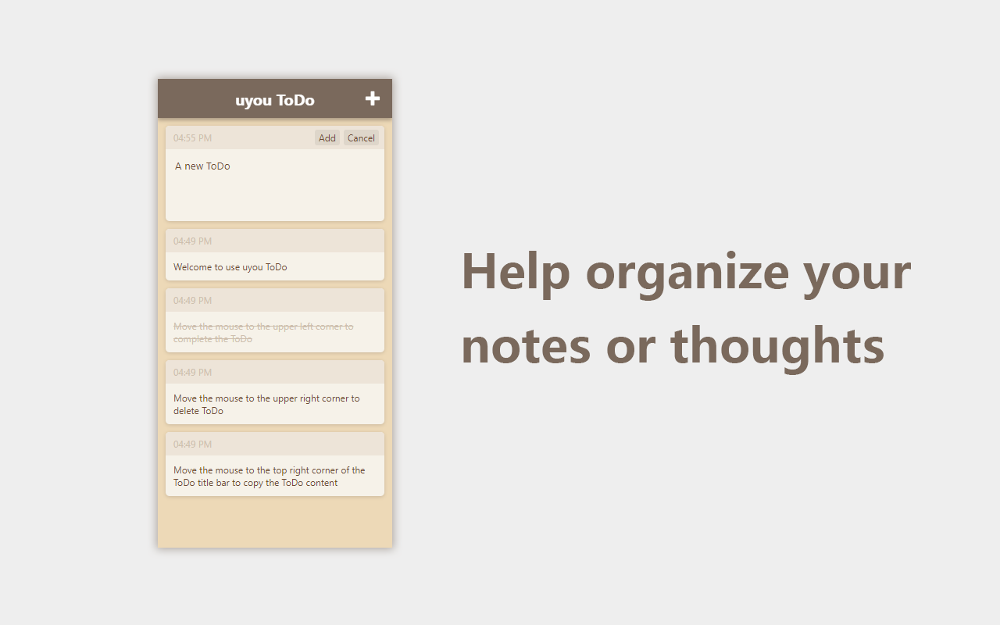

# uyouTodo
 
## How to use ?

1. Build chrome extension
    ``` 
    yarn
    yarn build
    ```
    * enable chrome developer
    * click the **Load unpacked extension** button
    * select the build folder to install it
    
2. Chrome web store or edge addons store\
   chrome: [TO CHROME WEB STORE](https://github.com/tonylu110/uyouTodo/releases)\
   edge: [TO EDGE ADDONS STORE](https://github.com/tonylu110/uyouTodo/releases)

3. To release page and download crx\
   [TO RELEASE](https://github.com/tonylu110/uyouTodo/releases)

## Preview



