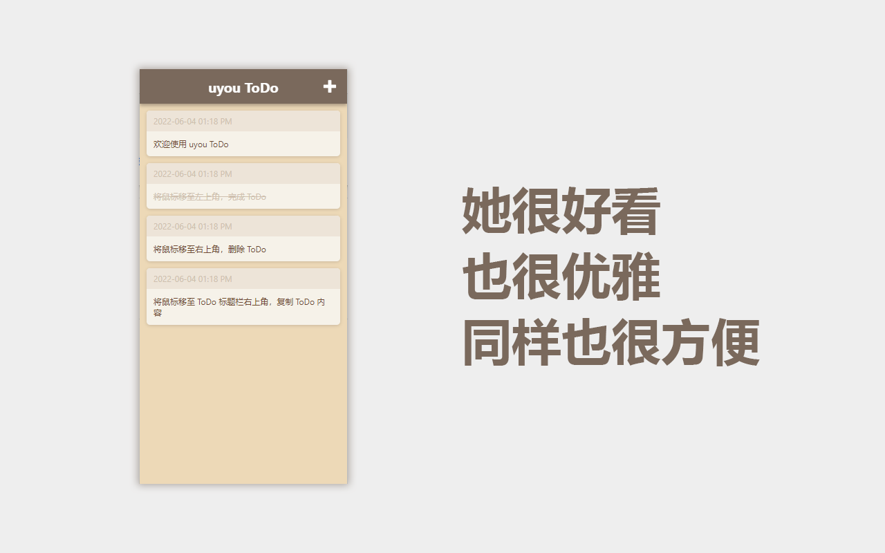
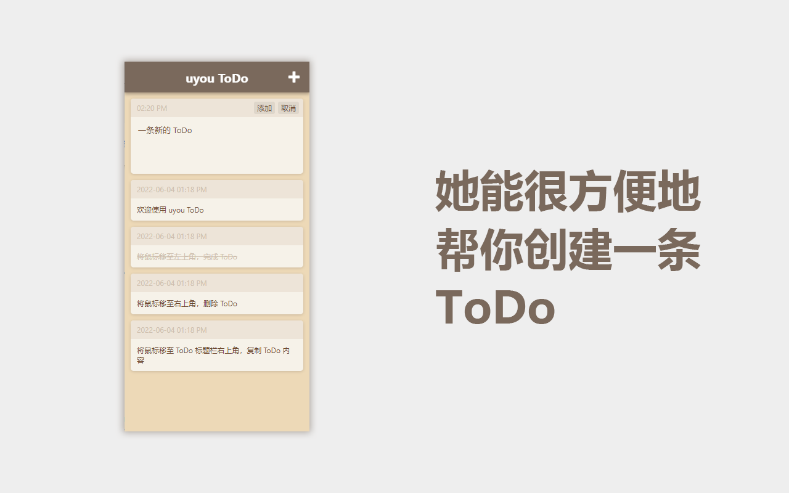

# uyouTodo
 
[English](https://github.com/tonylu110/uyouTodo) | 中文简体

## 如何使用？

1. 编译
    ``` 
    yarn
    yarn build
    ```
    * 打开 chrome 开发者模式
    * 点击**加载已解压的扩展**按钮
    * 选择编译好的文件夹安装
    
2. 在 chrome 网上应用店或 edge 外接商店下载\
   chrome：[前往 chrome 网上应用店](https://github.com/tonylu110/uyouTodo/releases)\
   edge：[前往 edge 外接商店](https://microsoftedge.microsoft.com/addons/detail/uyou-todo/efmogbhijocfeiaflifgjjkmfhjoplnp)

3. 在 release 页面下载 crx 文件安装\
   [前往 release 页面](https://github.com/tonylu110/uyouTodo/releases)

## 预览



